# AudioBook
> 감성분석을 통해 알맞은 bgm을 틀어주는 동화책 오디오북 웹서비스

### 개요

0. [간편하게 보기](#간편하게-보기)

1. [프로젝트 개요](#프로젝트-개요)
   1. Mission
   2. Solution
2. [딥러닝 모델 개발](#딥러닝-모델)
   1.  데이터 수집 및 전처리 
   2.  RNN & LSTM
   3. BERT & KOBERT
3. [웹 서비스](#웹-서비스)
   1. 시스템 구성도
   2. 음성 파일
   3. 웹 페이지 

## 간편하게 보기 

[발표 자료](https://drive.google.com/file/d/1gu9TRPmCGHAOk_6LE3zAYWKYn3IB2TZY/view?usp=sharing)

[음성파일](https://drive.google.com/file/d/16SzGQToCEw2zIUcOjd-bUKyhnYZkKGfy/view?usp=sharing)

## 프로젝트 개요

#### Mission

- 동화책 내용을 넣으면 텍스트를 인식하고 **감정을 분석**한다.
- 분석된 감정에 맞는 **배경음악을 동화책과 함께 출력**한다.
- 조금 더 쉽고, 편안하게, 아이들이 즐겁게 읽을 수 있도록 서비스를 만든다.

#### Solutions

- 자연어 처리를 통한 감성분석 딥러닝 모델 구현 
- 음성인식 API를 활용하여 텍스트를 읽어주고, 분석된 감성에 맞는 배경음악 송출 
- Django를 이용하여 웹서비스 구현

### 

## 딥러닝 모델

### 데이터 수집 및 전처리

- 동화책에서 나올 수 있는 감정의 종류들을 나열한 후 비슷한 감정을 합침
- 총 6개의 감정으로 결정

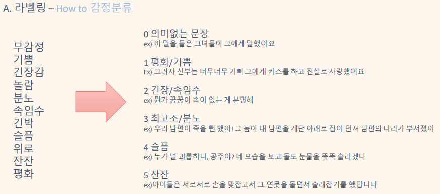

- 감정분류 라벨링 Rule

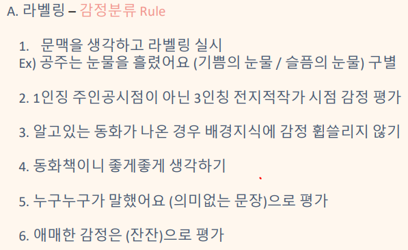

감정 라벨링 결과

- 동화책 124권(문장 13059개)에 대한 감정분류 라벨링 작업완료

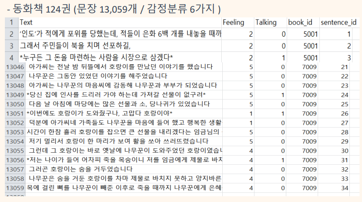

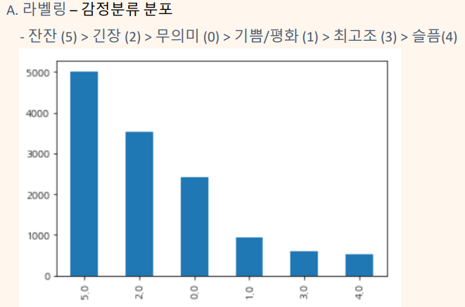

### RNN, LSTM

- RNN & LSTM 모델 같은 경우 학습이 이루어 지지 않고 정확도 또한 낮은것을 볼 수 있음
- 위와 같은 문제를 해결하기 위해 전처리/모델 부분에서 변경을 해보았지만, 성능 개선이 이루어지지 않았었음

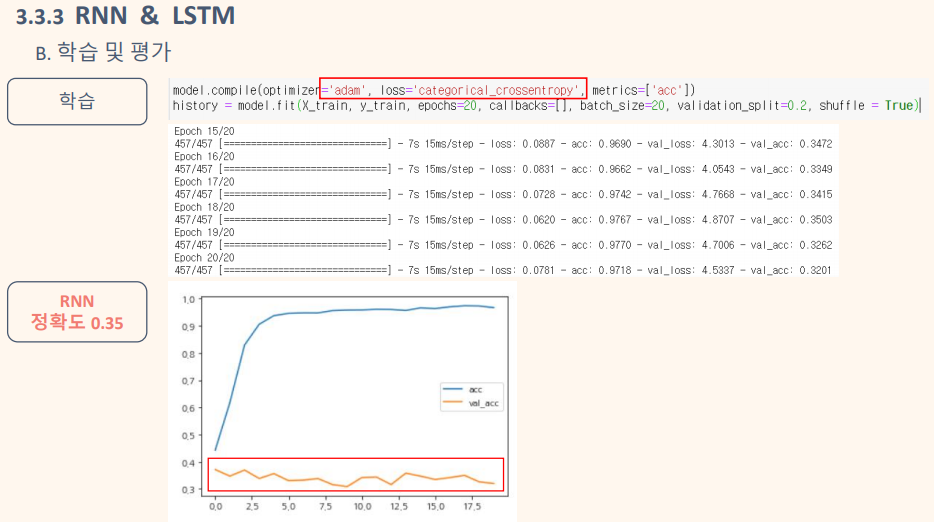

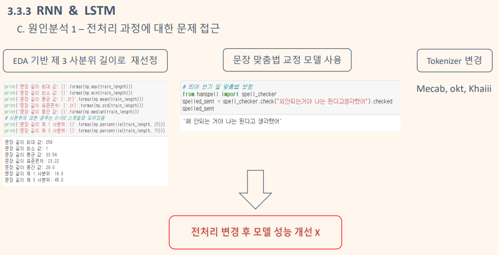

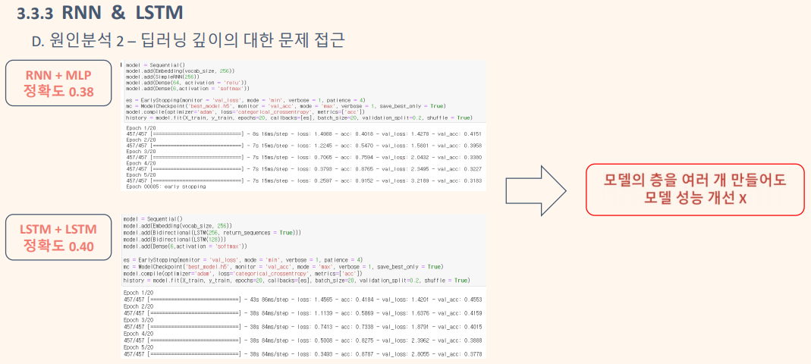

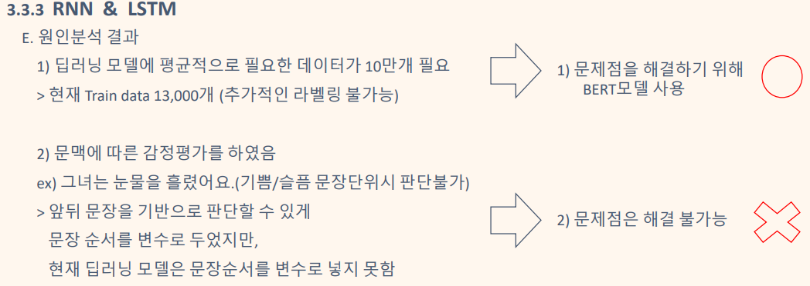

### Bert & KoBert

**Bert란?** 

- Pretrained 된 언어모델 위에 1개의 Classification layer만 부착하여 다양한 NLP Task를 수행

**KoBert란?**

- Bert도 한국어를 지원하지만, 형태소 단위 분석이 필요한 한국어의 특성에 맞춰서 발전시킨 것이 KoBert

실제로 KoBert가 형태소를 더 정확하게 분리해 내는 것을 볼 수 있음

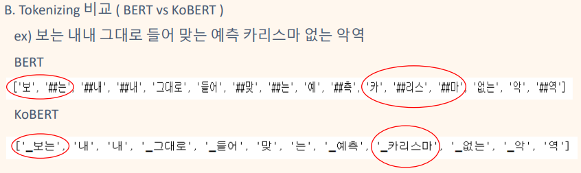

#### KoBert 모델 사용 및 모델 결과

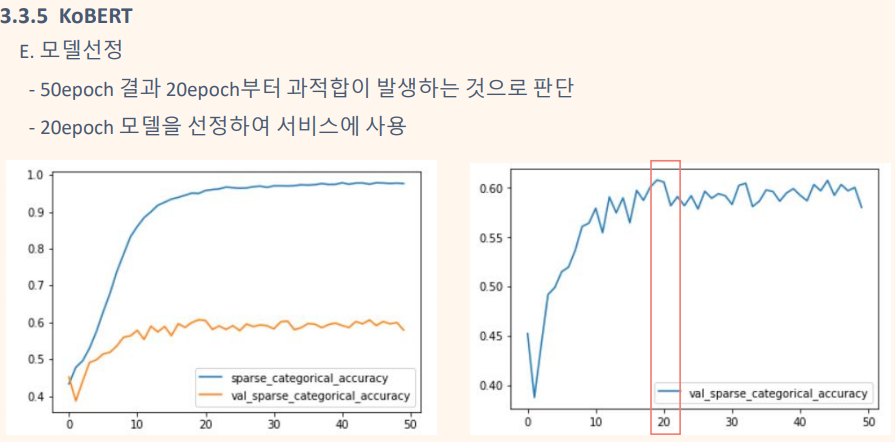

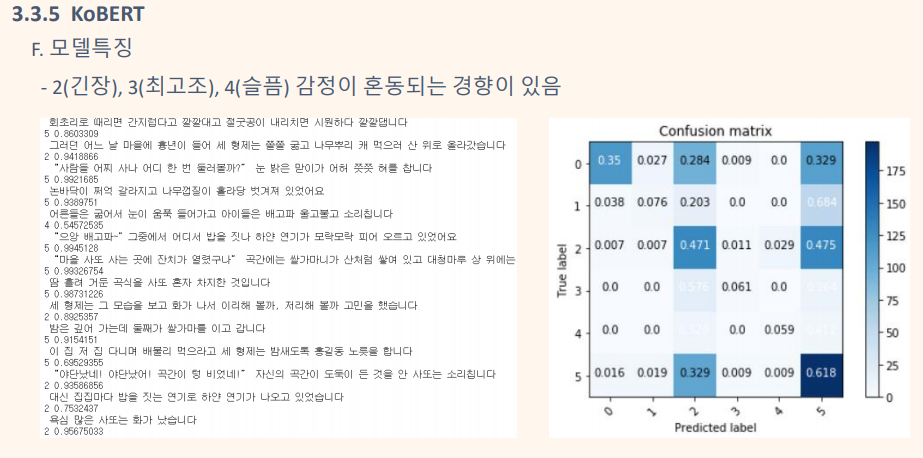

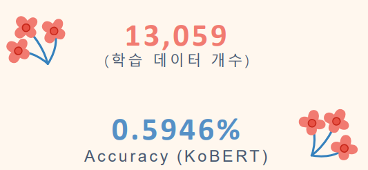

## 웹 서비스

### 시스템 구성도

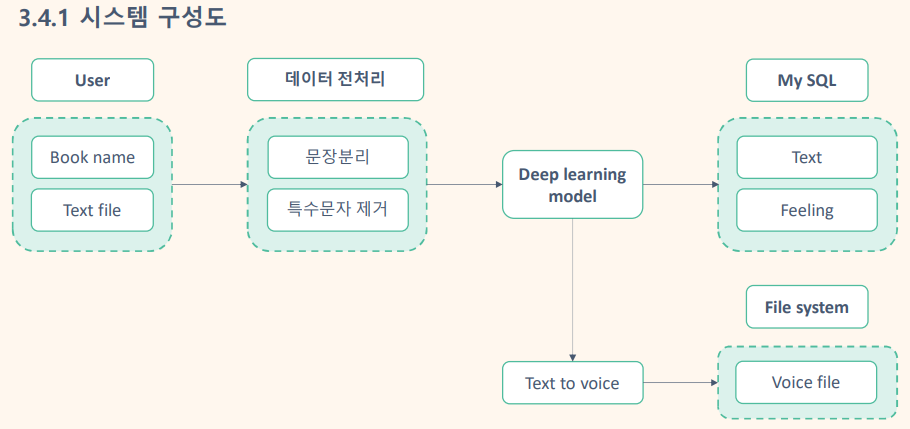

### 데이터 처리 방식 

1. 사용자가 .txt 파일을 업로드함
2. 문장을 분리하고 딥러닝 모델이 문장별 감정을 분류한다.
3. 카카오TTS 서비스를 활용하여 문장을 읽게하고 각 문장의 앞에 감정에 맞는 BGM이 들어오게 한다.

### 음성 파일

[음성파일 들어보기](https://drive.google.com/file/d/16SzGQToCEw2zIUcOjd-bUKyhnYZkKGfy/view?usp=sharing)

### 웹 페이지

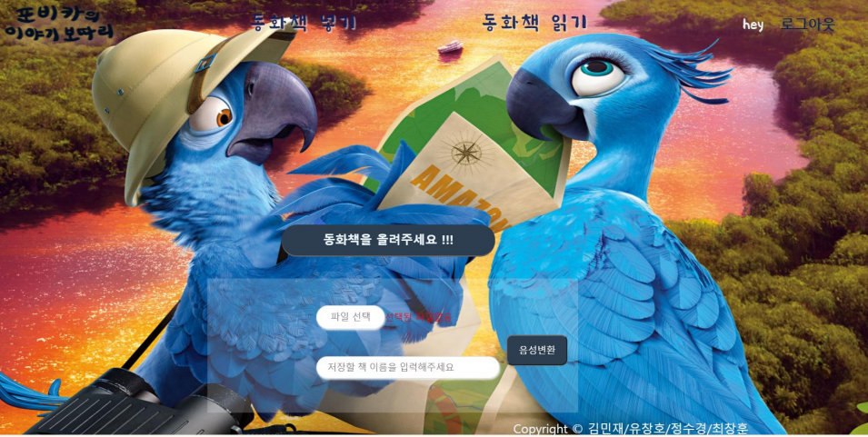

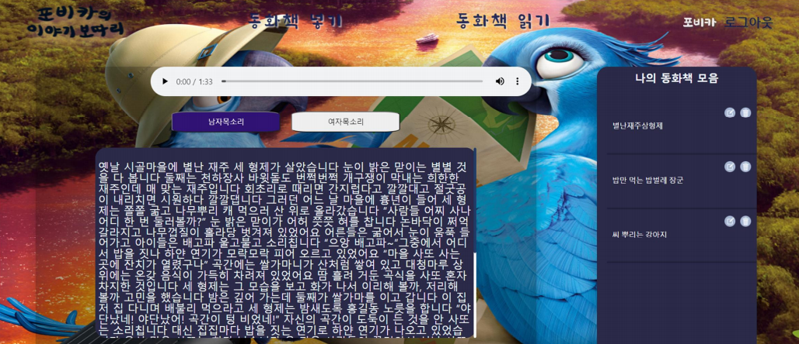
